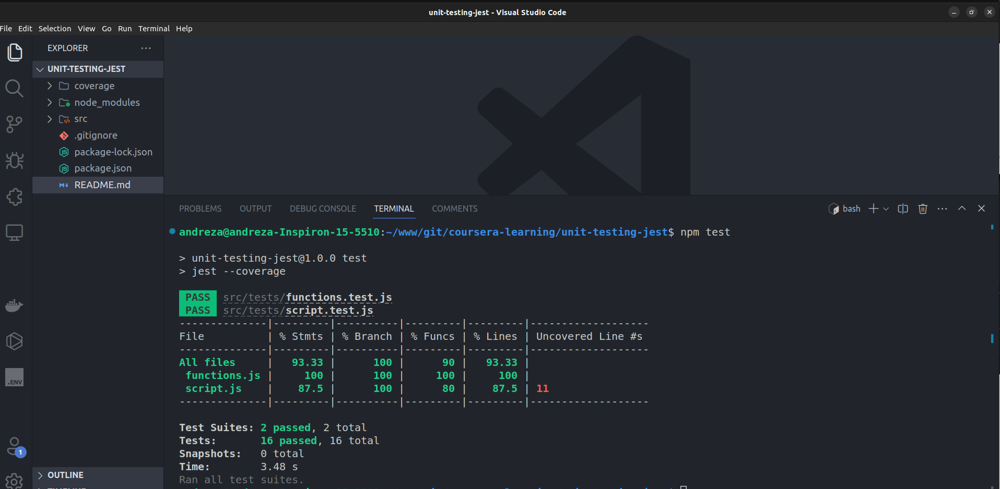

#### Introduction to Unit Testing in Jest - The Fundamentals - https://www.coursera.org/account/accomplishments/verify/JJPQW6JPSSLQ


#### # Clone the project
```sh
git clone -n https://github.com/andrezatcascais/coursera-learning.git
```
#### # to into the folder
```sh
cd coursera-learning
```
#### # checkout to repository
```sh
git checkout HEAD unit-testing-jest
```

#### # Install dependencies
```sh
npm install
```
#### # Run the test
```sh
npm test
```
#### # what shoud return


